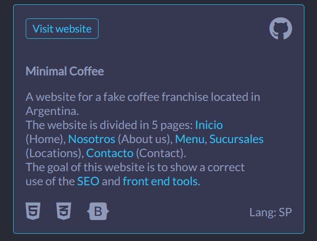

# First Project Portfolio

Other versions

[View the live project here](https://cilliagustin.github.io/first-project-portfolio/)

## Introduction
This website consists in my portolio which can be viewed in 5 different versions, each one representing one decade for front end development (from the eighties to the 2020)

### Purpose
#### For the creator:
To show all prevous projects created in a fun way that is engaging to the user and to show how a website can radycally change with just a few tweeks

#### For the user (potential employeer):
To see the creator´s capabilities in case he/she is looking for a new employee

## UX
### Development-Planes
The website consists in a landing page divided in 4 sections:
* Home
* About Me
* My work
* Contact

In the home section is a container with 5 different buttons, this can be pressed and toggle the different versions of the website. Changing, without refreshing, the site.

### Skeleton
The wireframes were created with the first version (the 2020 version) in mind. The other versions used most of the same structures but had some changes that differ from the original one. The wireframes were drawn using a desktop version of [Balsamiq](https://balsamiq.com/), the key for this aplication was provided by [Code Institute](https://codeinstitute.net/global/).
#### Mobile Wireframe

Wireframe

#### Desktop Wireframe

Wireframe

### Design
#### Design description
The design was made with a mobile first aproach. Using flexbox and mediaqueries to create the positioning for mobile and desktop versions.
* The 2020 version is a design created taking inspiration from varios web developer portfolio. the concept is a minimalistic and futuristic aproach of web design. This uses thin lines and a box-shadow to give elements a led effect when necesary.
* The 2010 version is inspired on the 2010 [facebook](https://www.facebook.com/) wall. All the information is displayed as if it were Facebook posts with the exception of the profile picture and the buttons for toggeling the versions that in the desktop version are fix positioned to look like asides.
* The 2000 version takes inspiration for the websites used in the beginning of the millennium. The Main title was stylised to look similar to the Microsoft Word´s WordArt. Floats were used so the text can wrap an image and there are plenty of effects (blink, marquee) applied to catch the user´s eye.
* The 1990 version takes it´s aesthetic from Microsoft´s Windows 98 operating system. Many of the elements were stylized to look like they were engraved in the screen and some look like they actually raise. All buttons have an effect when pressed that look like they are being sunken. The Photo displayed has a pixelated effect to intentionally lower the resolution.
* The 1980 version looks like an 80´s terminal. The site aplies a text shadow and is covered by an after pseudo element which apllies a filter that makes the whole screen look like a 1980´s computer monitor. This is the only version that does not use images (since it would interfear with the desired aesthetic) Intead in this cases uses ASCII code art to represent the pictures.

#### Colour
Each version has it´s own color palette that generates enough contrast and provides consistency through all the site, this were created taking inspiration from different sources which will be credited in the credit section.
##### 2020 palette

Other Palettes

##### 2010 palette

##### 2000 palette

##### 1990 palette

##### 1980 palette

#### Typography
With the exception of the 2010 version, all fonts were provided by [Google Fonts](https://fonts.google.com/)
* 2020: The section titles and the text next to the icons in the "my Work" section has [Montserrat](https://fonts.google.com/?query=montserrat) applied as the default font and the rest of the website uses [Lato](https://fonts.google.com/?query=lato) In both cases a backup of Sans-Serif has been applied.
* 2010: This is the only case where only one font is aplied through the hole site, this is [Helvetica](https://en.wikipedia.org/wiki/Helvetica)
* 2000: In this case [Work Sans](https://fonts.google.com/?query=work+sans) was used in all titles, navbar links, buttons and next to the icons in the "my Work" section with a back up of Sans-Serif. The rest of the website uses [Mali](https://fonts.google.com/?query=mali)  with a back up of Cursive.
* 1990: Here [VT323](https://fonts.google.com/?query=vt323) was used for all titles and [DotGothic16](https://fonts.google.com/?query=DotGothic16) for the rest of the site. In both cases a backup of Monospace has been applied.
* 1980: Finally [Press Start 2p](https://fonts.google.com/?query=press+start+2p) was used in all titles, in the text next to icons in the "My Work" section and as header in the portfolio-cards in the "My Work" section. The rest of the site uses [Share Tech Mono](https://fonts.google.com/?query=share+tech+mono). A backup of Monospace has been applied for the whole site.

#### Images
With the exception of my own photos, all images were provided by external sources which will be credited in the corresponding section. Is important to be noticed though that all the images were chosen with the intention to give consistency with the site and the tools which were available in each decade.

### Features
#### Loader
in order to provide a smooth transition when the versions are changed a loader was created. this occupies 100% of the pages height and with and has a fixed positioning blocking all the screen while the new styling for the page is loaded.

#### Navbar
The navbar has a fixed positioning on the top of the website. In the mobile version it collapses into a hamburger menu, when pressed the hamburger it displays the navegation menu. The desktop version displays the navegation menu normally without the use of a hamburger. When the user scrolls, this triggers a function that acording to where the user is located gives the respective nav link the active class. There are 5 different logo images used in the Navbar depending on the decade.
* The 2010 version on the mobile version when the Hamburger icon is pressed opens the menu, which occupied 100% of the width and height and displays icons next to the navbar links.
##### 2020 Navbar
###### Mobile

###### Desktop

See other Navbars

##### 2010 Navbar
###### Mobile

###### Desktop

##### 2000 Navbar
###### Mobile

###### Desktop

##### 1990 Navbar
###### Mobile

###### Desktop

##### 1980 Navbar
###### Mobile

###### Desktop

#### Home
The home section consists of the Title, subtitle and introductory text for the website. After this are located the 5 buttons which toggle the different website versions. Noticable changes in other versions:
* 2000: The main title has a background image that acts like a hero image and in the desktop version has the buttons located next to the text intead of under them like in the other versions.
* 2010: This version provides an extra image (profile picture) which in the mobile version is located in the top of the header and in the desktop version is located with a fixed positioning at the left of the website (emulating the profile picture positioning in facebook) the same happens with the buttons that are located to the right the same way Facebook places some extra links or advertising.

#### Buttons
This activate the main Javascript function that is the one that changes the css file, favicon and hides and shows the corresponding elements.
##### 2020 Buttons

See other buttons

##### 2010 Buttons

##### 2000 Buttons

##### 1990 Buttons

##### 1980 Buttons

#### About me
This section conists on an image, followed by a text that describes my experience. In the mobile version the text is located under the image and in bigger screen is sometimes located next to it.

##### Mobile

##### Desktop

See Other About Me versions

See 2010 Version

##### There Are no noticable changes between desktop and mobile versions

See 2000 Version

##### Mobile

##### Desktop

See 1990 Version

##### Mobile

##### Desktop

See 1980 Version

##### There Are no noticable changes between desktop and mobile versions

#### My work
My work section consists first of 4 icons that describe some of the characteristics of my work (Responsive, easy to navigate, Modern and fast). followed by it is my current portfolio (two projects when this file was written) each portfolio card consists of the title of the website, the website description, a list of technologies used and language abvailable for the website and two links (one for the website and one for the GitHub repository) but the order of how this information is presenter changes through some versions.

##### Work Icons

##### Portfolio

See other my work versions

2010

##### Work Icons

##### Portfolio

2000

##### Work Icons

##### Portfolio

1990

##### Work Icons

##### Portfolio

1980

##### Work Icons

##### Portfolio

#### Contact
The contact section consists of a form with redirect temporarily to a confitmation.html page. All the input displayed are mandatory. In the form all items are displayed in the revserse order and then have aplied a reverse column flex so the labels can be  stylized when the input are active.

#### Footer
The footer consists on my name and 2 links, one for my github profile and one to automatically send me an Email. this always share the same styling as the navbar to provide consistency but is not fixed positioned.

#### ASCII Code
As seen in the about me section and my work section, in the 1980 version there are no images used. Instead there is Ascii code art aplied in this section to provide the acompaning art.

## Testing

Testing information can be found in a separate testing [file](TESTING.md "Link to testing file")

## Technologies Used
### Main Languages Used

### Frameworks, Libraries & Programs Used

## Deployment
​
The site was deployed to GitHub pages. The steps to deploy are as follows: 
  - In the [GitHub repository](https://github.com/cilliagustin/first-project-portfolio), navigate to the Settings tab 
  - From the source section drop-down menu, select the **Main** Branch, then click "Save".
  - The page will be automatically refreshed with a detailed ribbon display to indicate the successful deployment.
​
The live link can be found [here](https://cilliagustin.github.io/first-project-portfolio)
​
### Local Deployment
​
In order to make a local copy of this project, you can clone it. In your IDE Terminal, type the following command to clone my repository:
​
- `git clone https://github.com/cilliagustin/first-project-portfolio.git`
​
Alternatively, if using Gitpod, you can click below to create your own workspace using this repository.
​

## Credits

## Acknowledgements