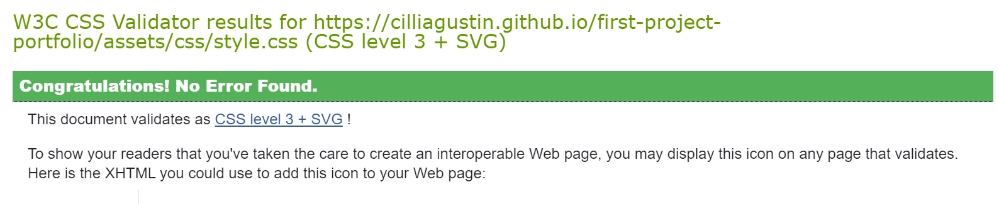
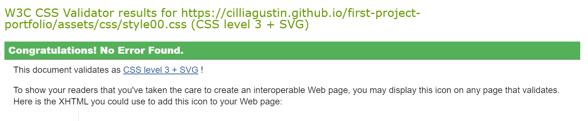
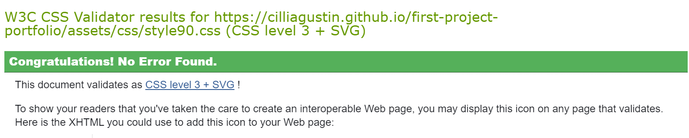
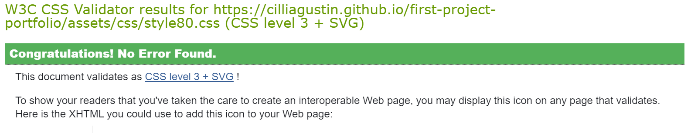
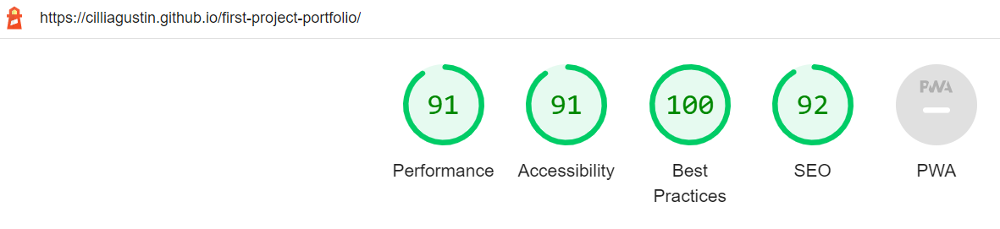
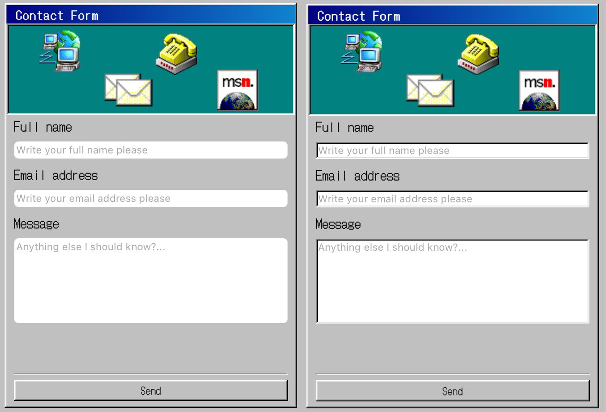

# Testing
    "Click to return back to the [README.md](README.md)"

## Browser Compatibility
    you must showcase proof with screenshots that you've tested the finished project on various browsers, such as Chrome, Firefox, Edge, Safari, Brave, etc.
## Code Validation

### HTML
Result from [W3C Markup Validation Service](https://validator.w3.org/):

   
### CSS
Since the website has 6 different css files each one has been validated.

Result from [W3C CSS Validation Service](https://jigsaw.w3.org/css-validator/) for general styling:

Result from [W3C CSS Validation Service](https://jigsaw.w3.org/css-validator/) for 2020 style sheet:

Result from [W3C CSS Validation Service](https://jigsaw.w3.org/css-validator/)for 2010 style sheet:

Result from [W3C CSS Validation Service](https://jigsaw.w3.org/css-validator/)for 2000 style sheet:

Result from [W3C CSS Validation Service](https://jigsaw.w3.org/css-validator/)for 1990 style sheet:

Result from [W3C CSS Validation Service](https://jigsaw.w3.org/css-validator/)for 1980 style sheet:

### JavaScript
Result from [JSHint](https://jshint.com/):

### Lighthouse
Result from [Lighthouse](https://chrome.google.com/webstore/detail/lighthouse/blipmdconlkpinefehnmjammfjpmpbjk?hl=es):

## Responsiveness
    you must showcase proof with screenshots that you've tested the finished project on different device sizes, such as mobile, tablet, desktop.

## Bugs
* On Safari the inputs (text and textarea) did not accept the styling. This was fixed by explicitely adding a border-radius 0 and -webkit-appearance none.

See bug

## Unfixed Bugs
There are no remaining bugs that I am aware of