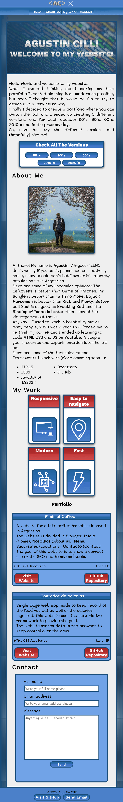
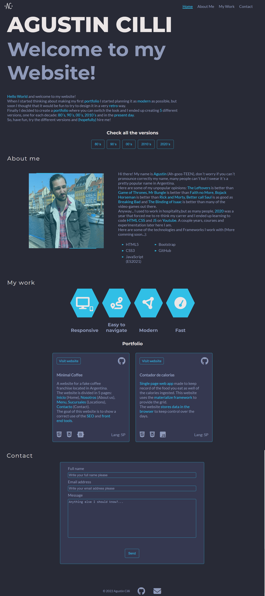

# Testing
"Click to return back to the [README.md](README.md)"

## Browser Compatibility
The site was tested to work correctly in [Google Chrome](https://www.google.com/chrome/), Mozilla [Firefox](https://www.mozilla.org/en-US/firefox/new/) and [Safari](https://www.apple.com/safari/). Here are some screenshots of the site in the different browsers.

Google Chrome

Firefox

Safari

## Code Validation

### HTML
Result from [W3C Markup Validation Service](https://validator.w3.org/):

   
### CSS
Since the website has 6 different CSS files each one has been validated.

Result from [W3C CSS Validation Service](https://jigsaw.w3.org/css-validator/) for general styling:

Result from [W3C CSS Validation Service](https://jigsaw.w3.org/css-validator/) for 2020 style sheet:

Result from [W3C CSS Validation Service](https://jigsaw.w3.org/css-validator/)for 2010 style sheet:

Result from [W3C CSS Validation Service](https://jigsaw.w3.org/css-validator/)for 2000 style sheet:

Result from [W3C CSS Validation Service](https://jigsaw.w3.org/css-validator/)for 1990 style sheet:

Result from [W3C CSS Validation Service](https://jigsaw.w3.org/css-validator/)for 1980 style sheet:

### JavaScript
Result from [JSHint](https://jshint.com/):

### Lighthouse
Result from [Lighthouse](https://chrome.google.com/webstore/detail/lighthouse/blipmdconlkpinefehnmjammfjpmpbjk?hl=es):

## Responsiveness
Here are screenshots of the website on the desktop and mobile version. The breakpoint for this is at 768px of width. There is no comparisson provided for the 1980 and 1990 versions since their main structure is very similar to the 2020´s one. There are though comparisions provided for the 2000 and 2010 since they structure varies a little bit more from the 2020 version.

2020

2010

2000

## Bugs
* On the 1990 version there was a problem with the inputs in the Form. On [Firefox](https://www.mozilla.org/en-US/firefox/new/) the text area has a bigger size than on other browsers and in [Safari](https://www.apple.com/safari/) both text inputs and the textarea did not accept the styling rules.
This was fixed by adding a specific height rule for the text area only on Firefox and the bug with Safari required a "-webkit-appearance none" rule and setting a specific border radius.

See bug

## Unfixed Bugs
There are no remaining bugs that I am aware of.

## Version Control
During my conversations with my mentor he called to my atention the fact that I was not correctly commiting my updates to the website (I added very few commits with long texts and many changes). After he informed me this and reminded me the correct way to aproach this I quickly changed my way of working but most of the website was with a wrong aproach to commits.